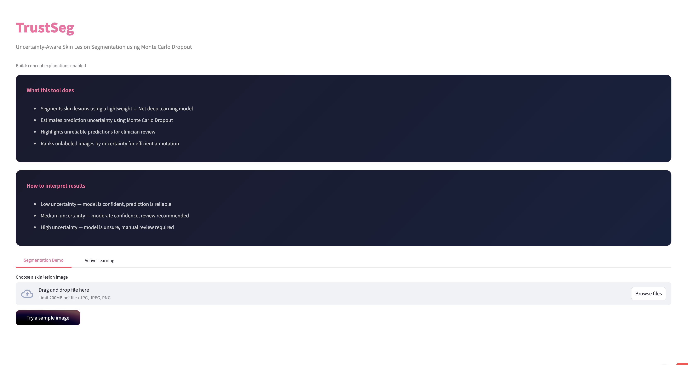
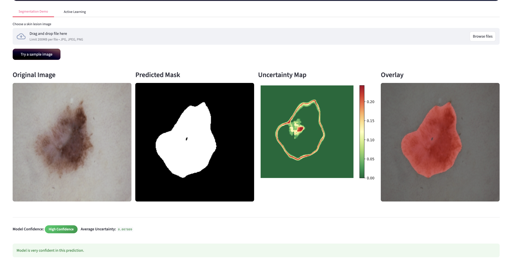
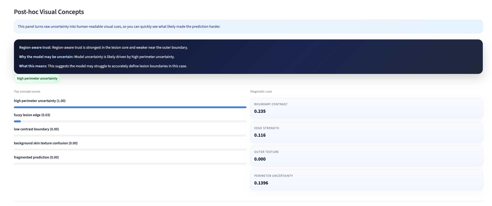

# TrustSeg: Uncertainty-Aware Skin Lesion Segmentation

> Deep learning-based skin lesion segmentation with predictive
> uncertainty estimation using **Monte Carlo Dropout**, interactive
> visualization, and uncertainty-guided active learning.


```{=html}
<p align="center">
```
``{=html}
```{=html}
</p>
```
## Overview

TrustSeg is an end-to-end medical image segmentation project that
explores an important question:

> **Can a segmentation model communicate when it is uncertain about its
> own prediction?**

Traditional segmentation models typically produce a binary mask without
conveying confidence. TrustSeg extends a U-Net segmentation pipeline
with **Monte Carlo Dropout** to estimate predictive uncertainty and
visualize regions where the model is less confident.

Beyond segmentation, the project includes:

-   Interactive Streamlit application
-   Pixel-wise uncertainty visualization
-   Dice score evaluation
-   Uncertainty vs. performance analysis
-   Uncertainty-guided active learning
-   Post-hoc concept explanations for uncertainty

------------------------------------------------------------------------

# Demo

### Home



### Prediction



### Uncertainty Visualization



------------------------------------------------------------------------

# Features

-   U-Net style encoder-decoder architecture with skip connections
-   Monte Carlo Dropout for Bayesian uncertainty approximation
-   Dice Loss optimization
-   Albumentations preprocessing and augmentation
-   Interactive Streamlit inference interface
-   Overlay visualization of predictions
-   Pixel-level uncertainty heatmaps
-   Active learning image ranking by uncertainty
-   Concept-based interpretation of uncertain predictions
-   Dice score evaluation pipeline
-   Uncertainty vs Dice correlation analysis

------------------------------------------------------------------------

# Pipeline

``` text
Input Image
     │
     ▼
Preprocessing
     │
     ▼
U-Net Segmentation
     │
     ├────────► Predicted Mask
     │
     ▼
20 Stochastic Forward Passes
     │
     ▼
Variance Across Predictions
     │
     ▼
Pixel-wise Uncertainty Map
     │
     ▼
Concept Analysis + Active Learning Ranking
```

------------------------------------------------------------------------

# Repository Structure

``` text
trustseg-uncertainty-segmentation/
│
├── app.py                      # Streamlit application
├── requirements.txt
├── README.md
│
├── assets/
│   ├── demo-home.png
│   ├── prediction-demo.png
│   └── uncertainty-demo.png
│
├── model/
│   └── best_model.pth
│
└── src/
    ├── dataset.py
    ├── model.py
    ├── train.py
    ├── evaluate.py
    ├── uncertainty.py
    ├── active_learning.py
    └── concepts.py
```

## Module Overview

  -----------------------------------------------------------------------
  File                         Purpose
  ---------------------------- ------------------------------------------
  `dataset.py`                 Loads ISIC images and masks with
                               Albumentations transforms

  `model.py`                   U-Net implementation with Dropout layers

  `train.py`                   Training loop, validation, checkpointing

  `evaluate.py`                Dice score evaluation and uncertainty
                               correlation

  `uncertainty.py`             Monte Carlo Dropout inference

  `active_learning.py`         Ranks unlabeled images by uncertainty

  `concepts.py`                Generates human-readable explanations for
                               uncertainty

  `app.py`                     Interactive Streamlit interface
  -----------------------------------------------------------------------

------------------------------------------------------------------------

# Technology Stack

-   Python
-   PyTorch
-   Torchvision
-   Albumentations
-   OpenCV
-   NumPy
-   Matplotlib
-   Streamlit

------------------------------------------------------------------------

# Installation

``` bash
git clone https://github.com/lbattu-rgb/trustseg-uncertainty-segmentation.git

cd trustseg-uncertainty-segmentation

python3 -m venv venv

source venv/bin/activate      # macOS/Linux

pip install -r requirements.txt
```

------------------------------------------------------------------------

# Dataset

Expected structure:

``` text
data/
├── images/
└── masks/
```

Masks should follow:

``` text
image001.jpg
image001_segmentation.png
```

------------------------------------------------------------------------

# Training

``` bash
python -m src.train
```

The best validation model is saved to:

``` text
model/best_model.pth
```

------------------------------------------------------------------------

# Evaluation

``` bash
python -m src.evaluate
```

This computes Dice scores across the evaluation dataset and generates an
uncertainty-versus-performance scatter plot.

------------------------------------------------------------------------

# Running the Application

``` bash
streamlit run app.py
```

The interface supports:

-   Image upload
-   Sample image inference
-   Segmentation mask visualization
-   Overlay rendering
-   Pixel-wise uncertainty heatmap
-   Confidence summary
-   Concept explanations
-   Active learning image ranking

------------------------------------------------------------------------

# Monte Carlo Dropout

During inference, dropout remains enabled and the network performs
multiple stochastic forward passes.

For every pixel:

-   Mean prediction → segmentation mask
-   Variance → uncertainty estimate

Higher variance indicates lower confidence.

------------------------------------------------------------------------

# Active Learning

TrustSeg ranks unlabeled images by predictive uncertainty.

Rather than labeling images randomly, users can prioritize samples the
model is least confident about, making annotation more efficient.

------------------------------------------------------------------------

# Post-hoc Concept Analysis

Beyond raw uncertainty maps, TrustSeg converts uncertainty into
interpretable descriptions by analyzing image characteristics such as:

-   Boundary contrast
-   Edge strength
-   Background texture
-   Prediction fragmentation
-   Perimeter uncertainty

These explanations help users understand *why* the model may be
uncertain.

------------------------------------------------------------------------

# Software Engineering

This repository emphasizes maintainable software engineering practices:

-   Modular project organization
-   Separation of training, inference, evaluation, and UI
-   Reusable preprocessing pipeline
-   Object-oriented model implementation
-   GPU/CPU compatibility
-   Consistent naming conventions
-   Saved checkpoints
-   Clear dependency management

------------------------------------------------------------------------

# Future Work

-   Add automated unit tests
-   Add GitHub Actions CI
-   Add configuration files (YAML)
-   Compare with additional uncertainty estimation methods
-   Benchmark larger segmentation architectures
-   Add model calibration metrics
-   Expand to multiclass segmentation

------------------------------------------------------------------------

# Acknowledgements

-   PyTorch
-   Streamlit
-   Albumentations
-   OpenCV

------------------------------------------------------------------------

# Contributing

Contributions, bug reports, and suggestions are welcome through Issues
and Pull Requests.

------------------------------------------------------------------------

# License

This project is suitable for release under the MIT License.
